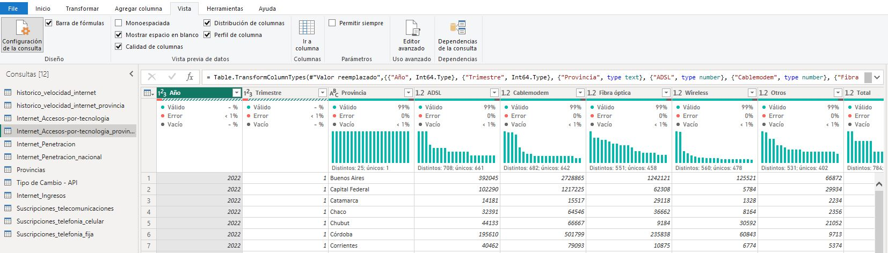
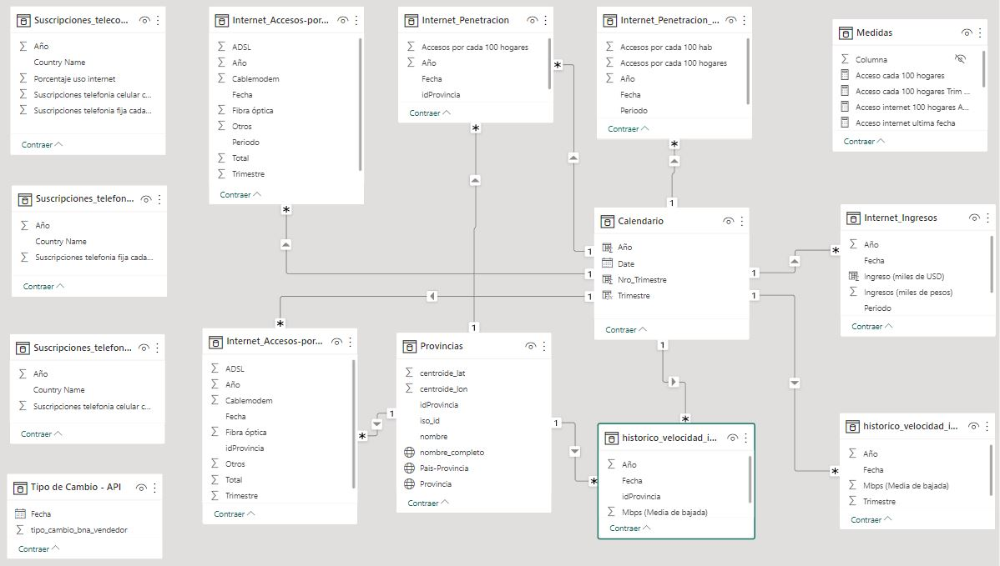

# **ANÁLISIS EXPLORATORIO Y MODELO DE DATOS**

- **Autor**: Nicolás Angel Lazarte

## Proyecto de Data Analitics - Telecomunicaciones

---

La industria de telecomunicaciones juega un papel muy importante en la actualidad, permitiendo la comunicación a nivel global y en tiempo real, facilitando todos los procesos que se llevan a cabo en una sociedad.

Para el presente proyecto se pretende realizar un análisis de diagnóstico de tipo estratégico de la industria de las telecomunicaciones, principalmente el acceso a internet, telefonía movil y fija a nivel nacional (Argentina) e internacional. Dicho análisis pretende brindar información de relevancia del pasado y presente, para sacar conclusiones y observaciones que permitan al cliente tomar desiciones a futuro en la mejora de los servicios.

## Elección de las fuentes de información

---

Con el objetivo de brindar información a nivel estratégico se utilizan las siguientes fuentes de información de las cuales se escogen ciertos datasets

- [**Acceso a Internet a nivel nacional**](https://datosabiertos.enacom.gob.ar/dashboards/20000/acceso-a-internet/): La situación histórica y el crecimiento del acceso a internet en el país es el principal tema a tratar al considerarlo la piedra angular del intercambio de información y facilidad de los procesos. En el link se cuentan con 16 tablas (archivos csv) disponibilizadas por ENACOM de las cuales se escogen solo se escogen 7 que contienen datos de la penetración de internet en los hogares, el empleo de la tecnología, velocidad de transferencia de datos y los ingresos del sector, abierto por provincia y a nivel nacional.
  - Penetración de internet cada 100 hogares (Nacional y provincial)
  - Tecnología de acceso (Nacional y provincial)
  - Histórico de velocidad de internet (Nacional y provincial)
  - Ingresos del sector en miles de pesos
- [**Tipo de cambio oficial Dolar-Peso argentino API**](https://apis.datos.gob.ar/series/api/series/?collapse=quarter&collapse_aggregation=avg&ids=168.1_T_CAMBIOR_D_0_0_26&limit=5000&format=csv): Se obtiene de la página oficial de datos de argentina el link de la API para traer datos de tipo de cambio y usarlos para llevar los ingresos del sector a la moneda norteamericana
- [**Provincias Argentinas**](https://datos.gob.ar/dataset/jgm-servicio-normalizacion-datos-geograficos/archivo/jgm_8.9): Listado de provincias argentinas normalizadas. Se descarga el archivo csv y se utiliza para normalizar y relacionar las tablas de acceso a internet
- [**Situación mundial de suscripciones a servicios de telecomunicación**](https://datos.bancomundial.org/indicator/IT.NET.USER.ZS?end=2021&start=1960&view=chart&year=2021): Para poder comparar cómo está la Argentina en el acceso a estos servicios se complementa la información con datasets relacionados a suscripción a internet, telefonía móvil y fija en todo el mundo y su evolución a lo largo del tiempo otorgado por el _Banco Mundial_. Se descargaron los siguientes archivos csv:
  - Personas que usan internet (% de la población)
  - Suscripciones a telefonía celular movil (por cada cada 100 personas)
  - Suscripciones a telefonía fija (por cada cada 100 personas)

## Análisis Exploratorio de Datos

---

Para facilitar el proceso y aprovechar las herramientas visuales que brinda Power Query, se decide cargar los archivos csv crudos a Power BI, recorrer cada tabla y evaluar la calidad de los catos con la ayuda de las herramientas de vista (Distribución, perfil y calidad de columnas) para estudiar valores faltantes, valores únicos, registros duplicados, tipos de datos de los campos, formato y estructuración de la tabla para analizar las formas normales y el modelo de datos, estandarización de valores, etc.



Como se puede observar en la imágen cada columna entrega información del tipo de dato, valores con error, vacíos, valores únicos, distribución de las variables, etc.
Tras un análisis exhaustivo de cada fuente, se puede decir que en general la calidad es relativamente buena, necesitando aplicar algunos pasos de transformación y limpieza necesarios para dejar el modelo acorde para ser analizado. Las observaciones son:

- Separadores de miles con puntos (.) que deberían eliminarse ya que éstos son separadores decimales. Las tablas afectadas son
  - Tablas de Acceso por tecnología (nacional y provincial)
  - Ingresos en el sector de telecomunicaciones
- Se otorgan datos de Año y Trimestre en las tablas relacionadas a internet que deberian incluir una fecha en dicho formato
- Registros nulos y con errores en tabla de acceso por tecnología a nivel provincial, entre ellos, inclusión del caracter asterisco (\*) en columna Año, guión del medio (-) para valores de cero en las columnas con variables cuantitativas (cantidad de suscriptores para cada tecnología)
- Falta de normalización de la base de datos en conjunto (columnas repetidas en varias tablas como la información de las provincias)
- Las tablas obtenidas del banco mundial relacionadas a las suscripciones a servicios de telecomunicaciones a nivel internacional cuentan con un formato incorrecto, donde cada año de evolución de los valores, corresponde a una columna dentro del dataframe

## Pasos de Transformación y Limpieza de datos

---

Dadas las observaciones del punto anterior se aplican los pasos necesarios dentro del espacio de transformación de Power Query

- Se promueven los encabezados
- Se reemplazan los puntos (.) por vacío en los datos de tipo numérico
- Reemplazo de asteriscos (\*) y guiones (-0) por vacío y cero respectivamente
- Se ejecuta un script de Python dentro del sector de transformación para todas las tablas relacionadas al acceso a internet que cuentan con datos de Año y trimestre. El script es el mismo para todas las tablas y es el siguiente:

```python
# 'dataset' contiene los datos de entrada para este script
import pandas as pd
dataset['Fecha'] = pd.to_datetime(dataset.apply(lambda x: f"{x['Año']}-{x['Trimestre']*3-2}-01", axis=1))
```

Se añade en cada tabla una columna fecha de acuerdo a los datos de año y trimestre, colocando la fecha del inicio del primer mes de cada trimestre. Esto sirve para elaborar la tabla calendario

- Se cambian los tipos de datos por detección automática y se colocan los formatos necesarios
- Para las tablas de acceso a internet abierto por provincia se realiza un Merge trayendo el IdProvincia de la tabla normalizada de provincias para solo dejar esta columna y vincularla con la tabla Provincias en el modelo de datos. De la misma manera para la tabla de ingresos se hace un merge del tipo de cambio en función de la fecha trimestral.
- Para las tablas del banco mundial se realizan algnos pasos como:
  - Se quitan columnas innecesarias
  - Se aplica dinamización de columnas para pasar los años a una sola columna y los registros también en una misma columna
  - Para el análisis se cree conveniente analizar desde el año 2000 por lo que se hace un filtro en estre sentido
  - Se quitan registros vacíos de la columna de año
  - Se unen los valores de suscripción a internet, telefonía fija y móvil con un merge dejandolos en una sola tabla y facilitar el análisis

## Modelo de Datos

---

Luego de ejecutar los pasos de transformación y limpieza, se revisa el modelo de datos y las relaciones necesarias que el contexto de filtro funcione correctamente

- Se crean una medida calculada dada por el `Ingreso en miles Dolares` dado por el cociente entre el Ingreso en miles de pesos y el tipo de cambio de la fecha correspondiente
- Se crea una tabla calendario y se vilcula con una cardinalidad de 1:M para las fechas de las tablas correspondientes
- Se crea una tabla de Medidas con sus correspondientes medidas


