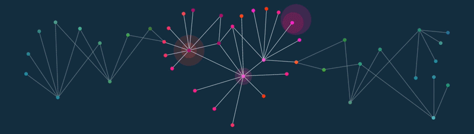

## **_PROYECTO INDIVIDUAL 03 - DATA ANALYST_**

---

<!-- Image -->

<picture>  </picture>

## **INTRODUCCIÓN**

Hola!👋 Me llamo Nicolás Angel Lazarte, les presento mi proyecto individual de Data Analytics realizado durante el Bootcamp de Data Science de SoyHenry.  
El proyecto consiste en realizar todo un proceso de análisis del sector de telecomunicaciones y presentarlo con alguna herramienta de visualización con la obtención de los insights correspondientes. El informe se presenta a ENACOM (Ente Nacional de Comunicaciones) como parte de un Rolplay como Consultor Data Analyst.

## **Objetivo**

Obtener información de valor (insights) a partir de datos históricos del sector de telecomunicaciones y que sean útiles principalmente para tomar decisiones estratégicas por parte de ENACOM en conjunto con las compañias privadas del sector para mejorar el servicio y promover la inclusión digital a toda la población Argentina.

## **Directorios y archivos del repositorio**

- [**Data**:](./Data/) Directorio donde se disponibilizan las fuentes de datos sin procesar. Son todos archivos csv
- [**Assets**:](./assets/) Directorio que incluye los recursos visuales necesarios (imágenes principalmente)
- [**Dashboard**:](./Dashboard-Telecomunicaciones.pbix) Reporte realizado en Power BI de Microsoft que refleja todo el análisis
- [**Análisis EDA y Modelo de datos**:](./AnalisisEDA-ModeloDatos.md) Informe de Análisis exploratorio de datos y modelado necesario para llevar a cabo el reporte

## **ETAPAS DEL PROYECTO**

---

### **1) Estudio de la fuente de datos y EDA (Exploratory Data Analysis)**

En primer lugar se realiza un estudio de las fuentes de datos disponibilizadas en archivos `.csv` en la página web de ENACOM (_Ente Nacional de Comunicaciones_) https://datosabiertos.enacom.gob.ar/
Se investigan otras fuentes de datos para agregar mas información y valor al análisis, entre ellas, datos del Banco mundial desde su pagina web.
Se hace una exploración de datos con Power Query una vez cargados los archivos en Power BI, revisión de duplicados, tipos de datos, valores faltantes y errores en los datos tomando las acciones necesarias.

### **2) ETL (Extract, Transform and Load)**

En el archivo de [**Análisis EDA y Modelo de datos**:](./AnalisisEDA-ModeloDatos.md) se mencionan los pasos realizados para transformar y limpiar los datos. Se utilizaron algunos scripts de Python como parte de la transformación para la obtención de las columnas de fecha. Se realiza el modelado para obtener datos que se relacionen entre sí.

### **3) Construcción del Dashboard**

Principalmente se tiene en cuenta 3 objetivos de análisis que considero son convenientes:

- Evaluar la penetración de internet en Argentina y los ingresos del sector
- Analizar la infraestructura tecnológica de telecomunicaciones en el país
- Comparar el impacto de los servicios a nivel nacional con otras regiones y países en el planeta. Verificar así el estado de situación actual y mejoras a futuro
  Se establecen KPIs:
- Variación porcentual trimestral de la penetración de internet cada 100 hogares, por provincia
- Variación porcentual anual de la penetración de internet cada 100 hogares, por provincia
- Variación porcentual anual de ingresos en dolares en el sector de telecomunicaciones
- Porcentaje de usuarios suscriptos con más de 50 mb de velocidad, por año y por provincia

### **4) Conclusiones**

Se realiza levanta un contenedor de docker a través de un Dockerfile que contiene los servicios y dependencias necesarias junto con las instrucciones para llevar la aplicación al entorno de Docker. Se construyen las imagenes y el contenedor a través de las siguientes líneas de código

## **STACK TECNOLÓGICO**

---

- Power BI
- Python
- Pandas

        

